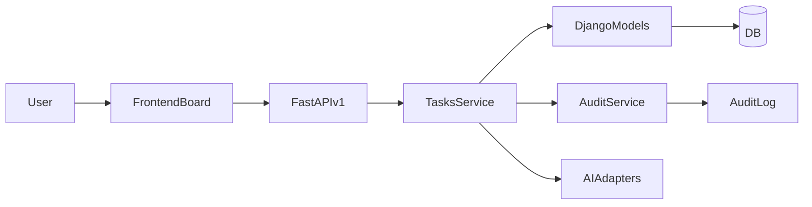

## Architecture Overview – Professional Task Board (Next-Level)

### Module-Landschaft
- **Frontend (React/TS)**: Kanban-Komponenten unter `frontend/src/components/dashboard/Kanban`, zentrale Typen unter `frontend/src/types/kanban.ts`, API-Client unter `frontend/src/api/`.
- **Backend (FastAPI + Django ORM)**: Router `backend/app/api/v1/tasks.py`, Service `backend/app/services/tasks_service.py`, Modelle in `backend/app/db/models`. Tenant = Workspace.
- **Core**: Auth/Scopes (`app/core/security.py`, `app/api/deps.py`), Audit (`app/services/audit.py`), Pagination.
- **Geplante Erweiterungen**: Boards/Projects/Statuses, Analytics-Service, AI-Service-Interfaces, Export-Endpunkte.

### Datenfluss (vereinfacht)

### Aktueller Flow
1. Frontend lädt Tasks via `/api/v1/tasks` (Filter: search/status/priority/assignee/...).
2. Service `TasksService.get_tasks` filtert/ordnet, baut `TaskResponse` (Labels/Subtasks/Activity derzeit TODO).
3. Drag&Drop/Status-Änderungen laufen über `PATCH /tasks/{id}` bzw. `/tasks/{id}/move`.
4. Audit-Service wird bei create/update/move/delete aufgerufen, aber Activity/Labels/Subtasks fehlen.

### Schwachstellen (markiert für TODO-Kommentare)
- Statische Spalten im Frontend (`ProfessionalKanbanBoard`), kein dynamisches Board/Workflow.
- Kein Multi-Projekt/Board-Modell (nur Tenant) und keine Rollen-Guards auf Board-Ebene.
- Backend-Model Task ohne Labels/Subtasks/Attachments/Activity/KI-Scores/Projekt/Board/WIP/Transitions.
- Filter/Analytics begrenzt; kein Export; keine gespeicherten Views; keine KI-Hooks.

### Zielbild (Kurzfassung)
- Boards pro Projekt/Team mit konfigurierbaren Status/WIP/Transitions, Tenant-basiert.
- Reiche Task-Details (Labels, Subtasks, Files, Activity/Audit) und KI-Unterstützung (Generate/Priorize/Assignee/Summary/Forecast).
- Analytics/Reports mit Durchsatz, Lead/Cycle-Time, Bottlenecks, SLA, Export.
- RBAC auf Tenant/Board-Ebene; KI-Entscheidungen auditierbar.

