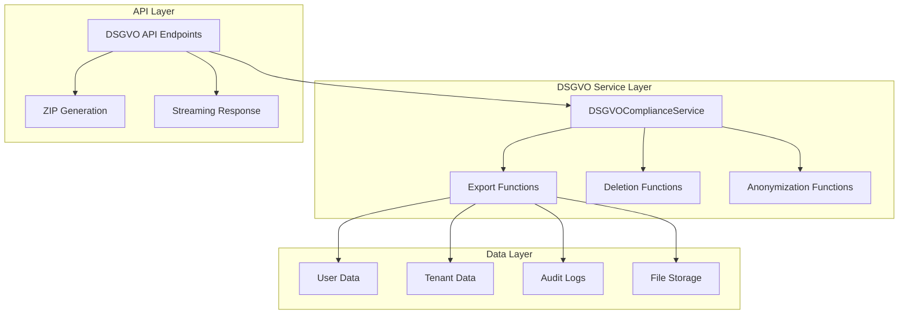

# DSGVO Compliance Implementation Guide

**Version**: 1.0  
**Datum**: 2025-01-27  
**Autor**: Chief Architect & Lead Auditor  

---

## Overview

Das ImmoNow-System implementiert umfassende **DSGVO-Compliance** mit vollständigen Export-, Löschungs- und Anonymisierungsfunktionen für alle personenbezogenen Daten.

### Kern-Features

- **Datenexport**: Vollständiger Export aller Benutzer- und Mandantendaten
- **Datenlöschung**: Soft-Delete (Anonymisierung) und Hard-Delete Optionen
- **Anonymisierung**: Strukturierte Anonymisierung mit Hash-Funktionen
- **Audit-Trails**: Vollständige Nachverfolgung aller DSGVO-Operationen
- **ZIP-Downloads**: Benutzerfreundliche ZIP-Dateien für Exports
- **Grace-Periods**: Konfigurierbare Wartefristen vor endgültiger Löschung

---

## 1. DSGVO-Compliance-Architektur

### 1.1 Service-Layer



### 1.2 Compliance-Endpoints

| Endpoint | Method | Purpose | Access Level |
|----------|--------|---------|--------------|
| `/api/v1/dsgvo/export/user/{user_id}` | POST | Export user data | Admin |
| `/api/v1/dsgvo/export/user/{user_id}/download` | GET | Download user export | Admin |
| `/api/v1/dsgvo/delete/user/{user_id}` | POST | Delete user data | Admin |
| `/api/v1/dsgvo/export/tenant` | POST | Export tenant data | Admin |
| `/api/v1/dsgvo/export/tenant/download` | GET | Download tenant export | Admin |
| `/api/v1/dsgvo/delete/tenant` | POST | Delete tenant data | Admin |
| `/api/v1/dsgvo/status` | GET | Get compliance status | User |

---

## 2. Datenexport-Funktionalität

### 2.1 User Data Export

Der User Data Export umfasst alle personenbezogenen Daten eines Benutzers:

```python
@router.post("/export/user/{user_id}")
async def export_user_data(user_id: str):
    """Export all user data for DSGVO compliance"""
    
    export_data = {
        "export_info": {
            "exported_at": "2025-01-27T10:00:00Z",
            "user_id": "uuid",
            "email": "user@example.com",
            "export_type": "full_user_data"
        },
        "user_profile": {
            "id": "uuid",
            "email": "user@example.com",
            "first_name": "John",
            "last_name": "Doe",
            "phone": "+49123456789",
            "is_active": True,
            "email_verified": True,
            "created_at": "2025-01-27T10:00:00Z",
            "last_login": "2025-01-27T09:00:00Z"
        },
        "tenant_memberships": [
            {
                "tenant_id": "uuid",
                "tenant_name": "My Company",
                "role": "admin",
                "scopes": ["read", "write", "delete", "admin"],
                "joined_at": "2025-01-27T10:00:00Z"
            }
        ],
        "properties": [
            {
                "id": "uuid",
                "title": "Beautiful Apartment",
                "property_type": "apartment",
                "status": "available",
                "price": 500000.00,
                "created_at": "2025-01-27T10:00:00Z"
            }
        ],
        "documents": [
            {
                "id": "uuid",
                "name": "Contract Template",
                "document_type": "contract",
                "size": 1024000,
                "uploaded_at": "2025-01-27T10:00:00Z"
            }
        ],
        "contacts": [
            {
                "id": "uuid",
                "first_name": "Jane",
                "last_name": "Smith",
                "email": "jane@example.com",
                "phone": "+49987654321",
                "created_at": "2025-01-27T10:00:00Z"
            }
        ],
        "tasks": [
            {
                "id": "uuid",
                "title": "Follow up with client",
                "status": "pending",
                "priority": "high",
                "due_date": "2025-01-30T10:00:00Z",
                "created_at": "2025-01-27T10:00:00Z"
            }
        ],
        "social_posts": [
            {
                "id": "uuid",
                "content": "New property listing!",
                "platform": "facebook",
                "status": "published",
                "published_at": "2025-01-27T10:00:00Z"
            }
        ],
        "audit_logs": [
            {
                "id": "uuid",
                "event_type": "user_login_success",
                "resource_type": "user",
                "action": "authenticate",
                "ip_address": "192.168.1.100",
                "created_at": "2025-01-27T10:00:00Z"
            }
        ]
    }
    
    return export_data
```

### 2.2 Tenant Data Export

Der Tenant Data Export umfasst alle Daten eines Mandanten:

```python
@router.post("/export/tenant")
async def export_tenant_data(tenant_id: str):
    """Export all tenant data for DSGVO compliance"""
    
    export_data = {
        "export_info": {
            "exported_at": "2025-01-27T10:00:00Z",
            "tenant_id": "uuid",
            "tenant_name": "My Company",
            "export_type": "full_tenant_data"
        },
        "tenant_info": {
            "id": "uuid",
            "name": "My Company",
            "slug": "my-company",
            "company_email": "info@mycompany.com",
            "plan": "starter",
            "max_users": 5,
            "max_properties": 25,
            "storage_limit_gb": 10,
            "storage_bytes_used": 2684354560,
            "created_at": "2025-01-27T10:00:00Z"
        },
        "users": [
            {
                "id": "uuid",
                "email": "user@example.com",
                "first_name": "John",
                "last_name": "Doe",
                "is_active": True,
                "created_at": "2025-01-27T10:00:00Z"
            }
        ],
        "properties": [
            {
                "id": "uuid",
                "title": "Beautiful Apartment",
                "property_type": "apartment",
                "status": "available",
                "price": 500000.00,
                "created_by": {
                    "id": "uuid",
                    "name": "John Doe"
                },
                "created_at": "2025-01-27T10:00:00Z"
            }
        ],
        "documents": [
            {
                "id": "uuid",
                "name": "Contract Template",
                "document_type": "contract",
                "size": 1024000,
                "uploaded_by": {
                    "id": "uuid",
                    "name": "John Doe"
                },
                "uploaded_at": "2025-01-27T10:00:00Z"
            }
        ],
        "contacts": [
            {
                "id": "uuid",
                "first_name": "Jane",
                "last_name": "Smith",
                "email": "jane@example.com",
                "phone": "+49987654321",
                "created_by": {
                    "id": "uuid",
                    "name": "John Doe"
                },
                "created_at": "2025-01-27T10:00:00Z"
            }
        ],
        "tasks": [
            {
                "id": "uuid",
                "title": "Follow up with client",
                "status": "pending",
                "priority": "high",
                "assigned_to": {
                    "id": "uuid",
                    "name": "John Doe"
                },
                "created_by": {
                    "id": "uuid",
                    "name": "Jane Smith"
                },
                "created_at": "2025-01-27T10:00:00Z"
            }
        ],
        "billing": {
            "id": "uuid",
            "stripe_customer_id": "cus_1234567890",
            "stripe_subscription_id": "sub_1234567890",
            "plan_key": "starter",
            "status": "active",
            "current_period_end": "2025-02-27T10:00:00Z",
            "cancel_at_period_end": False
        }
    }
    
    return export_data
```

### 2.3 ZIP-Download-Funktionalität

Alle Exports können als ZIP-Dateien heruntergeladen werden:

```python
def create_export_zip(export_data: Dict[str, Any], filename: str) -> bytes:
    """Create a ZIP file containing the exported data"""
    
    zip_buffer = io.BytesIO()
    
    with zipfile.ZipFile(zip_buffer, 'w', zipfile.ZIP_DEFLATED) as zip_file:
        # Add main data file
        zip_file.writestr(
            f"{filename}.json",
            json.dumps(export_data, indent=2, ensure_ascii=False)
        )
        
        # Add metadata file
        metadata = {
            "export_info": export_data.get("export_info", {}),
            "created_at": datetime.utcnow().isoformat() + "Z",
            "format_version": "1.0",
            "dsgvo_compliant": True
        }
        zip_file.writestr(
            "metadata.json",
            json.dumps(metadata, indent=2, ensure_ascii=False)
        )
        
        # Add README file
        readme_content = f"""
# DSGVO Data Export

This ZIP file contains a complete export of user/tenant data 
in compliance with GDPR (DSGVO) regulations.

## Contents

- `{filename}.json` - Main data export
- `metadata.json` - Export metadata
- `README.txt` - This file

## Privacy Notice

This export contains personal data as defined by GDPR Article 4(1).
The data should be handled according to applicable privacy laws.

## Export Date

{datetime.utcnow().strftime('%Y-%m-%d %H:%M:%S UTC')}
"""
        zip_file.writestr("README.txt", readme_content)
    
    zip_buffer.seek(0)
    return zip_buffer.getvalue()
```

---

## 3. Datenlöschung-Funktionalität

### 3.1 Soft Delete (Anonymisierung)

Soft Delete anonymisiert Daten statt sie zu löschen:

```python
@router.post("/delete/user/{user_id}")
async def delete_user_data(
    user_id: str,
    soft_delete: bool = True,
    grace_period_days: int = 30
):
    """Delete user data for DSGVO compliance"""
    
    if soft_delete:
        # Anonymize user data
        anonymized_email = f"deleted_user_{hash(user.email)}@anonymized.local"
        anonymized_name = f"Deleted User {hash(user.email)}"
        
        # Anonymize user profile
        user.email = anonymized_email
        user.first_name = anonymized_name
        user.last_name = ""
        user.phone = ""
        user.is_active = False
        user.email_verified = False
        user.save()
        
        # Anonymize tenant memberships
        tenant_users = TenantUser.objects.filter(user_id=user_id)
        for tenant_user in tenant_users:
            tenant_user.is_active = False
            tenant_user.save()
        
        # Anonymize properties
        properties = Property.objects.filter(created_by_id=user_id)
        for property in properties:
            property.description = f"[Content anonymized - previously by {anonymized_name}]"
            property.save()
        
        # Anonymize documents
        documents = Document.objects.filter(uploaded_by_id=user_id)
        for document in documents:
            document.name = f"[Anonymized] {document.name}"
            document.description = f"[Content anonymized - previously by {anonymized_name}]"
            document.save()
        
        # Anonymize contacts
        contacts = Contact.objects.filter(created_by_id=user_id)
        for contact in contacts:
            contact.first_name = f"Contact {hash(contact.email)}"
            contact.last_name = ""
            contact.email = f"contact_{hash(contact.email)}@anonymized.local"
            contact.phone = ""
            contact.company = ""
            contact.notes = f"[Content anonymized - previously by {anonymized_name}]"
            contact.save()
        
        # Anonymize tasks
        tasks = Task.objects.filter(assigned_to_id=user_id)
        for task in tasks:
            task.title = f"[Anonymized] {task.title}"
            task.description = f"[Content anonymized - previously by {anonymized_name}]"
            task.save()
        
        # Anonymize social posts
        social_posts = SocialPost.objects.filter(author_id=user_id)
        for post in social_posts:
            post.content = f"[Content anonymized - previously by {anonymized_name}]"
            post.save()
        
        # Anonymize audit logs
        audit_logs = AuditLog.objects.filter(user_id=user_id)
        for log in audit_logs:
            log.details = f"[Content anonymized - previously by {anonymized_name}]"
            log.save()
    
    return deletion_summary
```

### 3.2 Hard Delete

Hard Delete löscht Daten permanent (mit Vorsicht verwenden):

```python
async def hard_delete_user_data(user_id: str):
    """Hard delete user data (use with caution)"""
    
    # Delete tenant memberships
    tenant_users_count = TenantUser.objects.filter(user_id=user_id).count()
    TenantUser.objects.filter(user_id=user_id).delete()
    
    # Delete user-created properties
    properties_count = Property.objects.filter(created_by_id=user_id).count()
    Property.objects.filter(created_by_id=user_id).delete()
    
    # Delete user-uploaded documents
    documents_count = Document.objects.filter(uploaded_by_id=user_id).count()
    Document.objects.filter(uploaded_by_id=user_id).delete()
    
    # Delete user-created contacts
    contacts_count = Contact.objects.filter(created_by_id=user_id).count()
    Contact.objects.filter(created_by_id=user_id).delete()
    
    # Delete user tasks
    tasks_count = Task.objects.filter(assigned_to_id=user_id).count()
    Task.objects.filter(assigned_to_id=user_id).delete()
    
    # Delete social posts
    social_posts_count = SocialPost.objects.filter(author_id=user_id).count()
    SocialPost.objects.filter(author_id=user_id).delete()
    
    # Delete audit logs
    audit_logs_count = AuditLog.objects.filter(user_id=user_id).count()
    AuditLog.objects.filter(user_id=user_id).delete()
    
    # Finally delete user
    user.delete()
    
    return {
        "user_id": user_id,
        "deletion_type": "hard_delete",
        "deleted_items": {
            "tenant_memberships": tenant_users_count,
            "properties": properties_count,
            "documents": documents_count,
            "contacts": contacts_count,
            "tasks": tasks_count,
            "social_posts": social_posts_count,
            "audit_logs": audit_logs_count
        }
    }
```

### 3.3 Grace Period Management

Grace Periods ermöglichen eine Wartefrist vor der endgültigen Löschung:

```python
async def schedule_hard_deletion(
    user_id: str, 
    grace_period_days: int = 30
):
    """Schedule hard deletion after grace period"""
    
    deletion_date = datetime.utcnow() + timedelta(days=grace_period_days)
    
    # Log scheduled deletion
    log_business_event(
        event_type="hard_deletion_scheduled",
        event_data={
            "user_id": user_id,
            "scheduled_date": deletion_date.isoformat(),
            "grace_period_days": grace_period_days
        }
    )
    
    # Store in database for processing by background job
    DeletionSchedule.objects.create(
        user_id=user_id,
        scheduled_date=deletion_date,
        grace_period_days=grace_period_days,
        status="scheduled"
    )
```

---

## 4. Audit-Trails und Compliance-Logging

### 4.1 DSGVO-Audit-Events

Alle DSGVO-Operationen werden vollständig protokolliert:

```python
# Export events
log_audit_event(
    event_type="dsgvo_user_export_requested",
    resource_type="user",
    resource_id=user_id,
    action="export",
    details={
        "exported_by": current_user.user_id,
        "export_type": "full_user_data"
    },
    user_id=current_user.user_id,
    tenant_id=tenant_id
)

# Deletion events
log_audit_event(
    event_type="dsgvo_user_deletion_requested",
    resource_type="user",
    resource_id=user_id,
    action="delete",
    details={
        "deleted_by": current_user.user_id,
        "deletion_type": "soft_delete",
        "grace_period_days": grace_period_days,
        "deleted_items": deletion_summary["deleted_items"]
    },
    user_id=current_user.user_id,
    tenant_id=tenant_id
)

# Download events
log_audit_event(
    event_type="dsgvo_user_export_downloaded",
    resource_type="user",
    resource_id=user_id,
    action="download",
    details={
        "downloaded_by": current_user.user_id,
        "file_size": len(zip_content)
    },
    user_id=current_user.user_id,
    tenant_id=tenant_id
)
```

### 4.2 Compliance-Status-Endpoint

Der Status-Endpoint bietet Einblick in die Compliance-Situation:

```python
@router.get("/status")
async def get_dsgvo_status(tenant_id: str):
    """Get DSGVO compliance status"""
    
    status_data = {
        "tenant_id": str(tenant.id),
        "tenant_name": tenant.name,
        "compliance_status": "compliant",
        "data_retention_policy": {
            "user_data_retention_days": 365,
            "audit_log_retention_days": 2555,  # 7 years
            "deleted_data_retention_days": 30
        },
        "data_counts": {
            "users": users_count,
            "properties": properties_count,
            "documents": documents_count,
            "contacts": contacts_count,
            "tasks": tasks_count
        },
        "export_capabilities": {
            "user_data_export": True,
            "tenant_data_export": True,
            "bulk_export": True,
            "zip_download": True
        },
        "deletion_capabilities": {
            "soft_delete": True,
            "hard_delete": True,
            "anonymization": True,
            "grace_period": True
        },
        "last_updated": datetime.utcnow().isoformat() + "Z"
    }
    
    return status_data
```

---

## 5. Anonymisierungsstrategien

### 5.1 Hash-basierte Anonymisierung

```python
def anonymize_email(email: str) -> str:
    """Anonymize email using hash"""
    return f"user_{hash(email)}@anonymized.local"

def anonymize_name(first_name: str, last_name: str) -> str:
    """Anonymize name using hash"""
    full_name = f"{first_name} {last_name}"
    return f"User {hash(full_name)}"

def anonymize_phone(phone: str) -> str:
    """Anonymize phone number"""
    return f"+49{hash(phone) % 1000000000:09d}"
```

### 5.2 Strukturelle Anonymisierung

```python
def anonymize_property_description(description: str, original_author: str) -> str:
    """Anonymize property description while preserving structure"""
    return f"[Content anonymized - previously by {original_author}]"

def anonymize_document_name(name: str) -> str:
    """Anonymize document name while preserving file extension"""
    name_parts = name.rsplit('.', 1)
    if len(name_parts) == 2:
        return f"[Anonymized].{name_parts[1]}"
    return f"[Anonymized] {name}"

def anonymize_contact_notes(notes: str, original_author: str) -> str:
    """Anonymize contact notes"""
    return f"[Content anonymized - previously by {original_author}]"
```

---

## 6. Datenminimierung und Retention

### 6.1 Retention-Policies

```python
class DataRetentionPolicy:
    """Data retention policy configuration"""
    
    USER_DATA_RETENTION_DAYS = 365
    AUDIT_LOG_RETENTION_DAYS = 2555  # 7 years
    DELETED_DATA_RETENTION_DAYS = 30
    AUTO_DELETE_ENABLED = True
    NOTIFICATION_DAYS_BEFORE_DELETION = 7

async def cleanup_expired_data():
    """Clean up data that exceeds retention period"""
    
    cutoff_date = datetime.utcnow() - timedelta(days=DataRetentionPolicy.USER_DATA_RETENTION_DAYS)
    
    # Find users inactive for retention period
    expired_users = User.objects.filter(
        last_login__lt=cutoff_date,
        is_active=False
    )
    
    for user in expired_users:
        # Schedule for deletion
        await schedule_hard_deletion(str(user.id), grace_period_days=0)
        
        # Log cleanup event
        log_audit_event(
            event_type="data_retention_cleanup",
            resource_type="user",
            resource_id=str(user.id),
            action="schedule_deletion",
            details={
                "reason": "retention_period_exceeded",
                "last_login": user.last_login.isoformat() if user.last_login else None,
                "cutoff_date": cutoff_date.isoformat()
            }
        )
```

### 6.2 Datenminimierung

```python
def minimize_export_data(export_data: Dict[str, Any]) -> Dict[str, Any]:
    """Minimize exported data to only necessary fields"""
    
    minimized_data = {
        "export_info": export_data["export_info"],
        "user_profile": {
            "id": export_data["user_profile"]["id"],
            "email": export_data["user_profile"]["email"],
            "first_name": export_data["user_profile"]["first_name"],
            "last_name": export_data["user_profile"]["last_name"],
            "created_at": export_data["user_profile"]["created_at"],
            "last_login": export_data["user_profile"]["last_login"]
        },
        "tenant_memberships": [
            {
                "tenant_name": membership["tenant_name"],
                "role": membership["role"],
                "joined_at": membership["joined_at"]
            }
            for membership in export_data["tenant_memberships"]
        ],
        "properties": [
            {
                "title": property["title"],
                "property_type": property["property_type"],
                "status": property["status"],
                "price": property["price"],
                "created_at": property["created_at"]
            }
            for property in export_data["properties"]
        ]
    }
    
    return minimized_data
```

---

## 7. Sicherheitsaspekte

### 7.1 Zugriffskontrolle

```python
@router.post("/export/user/{user_id}")
async def export_user_data(
    user_id: str,
    current_user: TokenData = Depends(require_admin_scope),
    tenant_id: str = Depends(get_tenant_id)
):
    """Export user data - Admin access required"""
    
    # Verify user has admin permissions
    if "admin" not in current_user.scopes:
        raise HTTPException(
            status_code=status.HTTP_403_FORBIDDEN,
            detail="Admin access required for data export"
        )
    
    # Verify user exists and is accessible
    user_exists = await sync_to_async(User.objects.filter(id=user_id).exists)()
    if not user_exists:
        raise HTTPException(
            status_code=status.HTTP_404_NOT_FOUND,
            detail="User not found"
        )
    
    # Log access attempt
    log_audit_event(
        event_type="dsgvo_export_access_attempt",
        resource_type="user",
        resource_id=user_id,
        action="access",
        details={
            "accessed_by": current_user.user_id,
            "ip_address": request.client.host,
            "user_agent": request.headers.get("user-agent")
        },
        user_id=current_user.user_id,
        tenant_id=tenant_id
    )
```

### 7.2 Rate Limiting

```python
# DSGVO endpoints have stricter rate limiting
DSGVO_RATE_LIMITS = {
    "export": {"requests": 5, "window": 3600},  # 5 exports per hour
    "delete": {"requests": 2, "window": 3600},  # 2 deletions per hour
    "download": {"requests": 10, "window": 3600}  # 10 downloads per hour
}
```

### 7.3 Datenverschlüsselung

```python
def encrypt_export_data(data: Dict[str, Any], key: str) -> bytes:
    """Encrypt export data for secure transmission"""
    
    from cryptography.fernet import Fernet
    
    # Convert data to JSON
    json_data = json.dumps(data, ensure_ascii=False)
    
    # Encrypt data
    fernet = Fernet(key.encode())
    encrypted_data = fernet.encrypt(json_data.encode())
    
    return encrypted_data

def decrypt_export_data(encrypted_data: bytes, key: str) -> Dict[str, Any]:
    """Decrypt export data"""
    
    from cryptography.fernet import Fernet
    
    # Decrypt data
    fernet = Fernet(key.encode())
    decrypted_data = fernet.decrypt(encrypted_data)
    
    # Convert back to dictionary
    return json.loads(decrypted_data.decode())
```

---

## 8. Best Practices

### 8.1 DSGVO-Compliance-Checkliste

#### Vor Export
- ✅ Benutzer identifiziert und authentifiziert
- ✅ Export-Berechtigung überprüft
- ✅ Audit-Log erstellt
- ✅ Datenminimierung angewendet

#### Während Export
- ✅ Vollständige Datenabdeckung
- ✅ Strukturierte JSON-Ausgabe
- ✅ Metadaten hinzugefügt
- ✅ ZIP-Datei generiert

#### Nach Export
- ✅ Download-Log erstellt
- ✅ Zugriff protokolliert
- ✅ Sicherheitskopie erstellt
- ✅ Retention-Policy angewendet

### 8.2 Löschungs-Checkliste

#### Vor Löschung
- ✅ Löschungsgrund dokumentiert
- ✅ Betroffene Daten identifiziert
- ✅ Backup erstellt
- ✅ Stakeholder informiert

#### Während Löschung
- ✅ Soft-Delete bevorzugt
- ✅ Anonymisierung durchgeführt
- ✅ Grace-Period gesetzt
- ✅ Audit-Log erstellt

#### Nach Löschung
- ✅ Löschung bestätigt
- ✅ Stakeholder informiert
- ✅ Hard-Delete geplant
- ✅ Compliance-Status aktualisiert

---

## 9. Monitoring und Alerting

### 9.1 Compliance-Metriken

```python
# Monitor DSGVO compliance metrics
def track_compliance_metrics():
    """Track DSGVO compliance metrics"""
    
    metrics = {
        "exports_today": ExportLog.objects.filter(
            created_at__date=datetime.utcnow().date()
        ).count(),
        "deletions_today": DeletionLog.objects.filter(
            created_at__date=datetime.utcnow().date()
        ).count(),
        "pending_deletions": DeletionSchedule.objects.filter(
            status="scheduled"
        ).count(),
        "compliance_score": calculate_compliance_score()
    }
    
    return metrics

def calculate_compliance_score() -> float:
    """Calculate overall compliance score"""
    
    score = 100.0
    
    # Check data retention compliance
    expired_data_count = get_expired_data_count()
    if expired_data_count > 0:
        score -= min(20, expired_data_count * 2)
    
    # Check audit log completeness
    incomplete_audits = get_incomplete_audit_count()
    if incomplete_audits > 0:
        score -= min(15, incomplete_audits * 3)
    
    # Check export capabilities
    if not is_export_functional():
        score -= 25
    
    # Check deletion capabilities
    if not is_deletion_functional():
        score -= 25
    
    return max(0, score)
```

### 9.2 Alerting-Regeln

```yaml
# Prometheus alerting rules for DSGVO compliance
- alert: DSGVOComplianceScoreLow
  expr: dsgvo_compliance_score < 80
  for: 5m
  labels:
    severity: warning
  annotations:
    summary: "DSGVO compliance score is low"
    description: "Compliance score is {{ $value }}%"

- alert: DSGVOExportFailure
  expr: rate(dsgvo_export_failures_total[5m]) > 0.1
  for: 2m
  labels:
    severity: critical
  annotations:
    summary: "DSGVO export failures detected"
    description: "Export failure rate is {{ $value }} per second"

- alert: DSGVODeletionOverdue
  expr: dsgvo_pending_deletions > 10
  for: 1h
  labels:
    severity: warning
  annotations:
    summary: "Too many pending DSGVO deletions"
    description: "{{ $value }} deletions are overdue"
```

---

## 10. Troubleshooting

### 10.1 Häufige Probleme

#### Export-Fehler
```python
# Debug export issues
def debug_export_failure(user_id: str):
    """Debug export failure"""
    
    # Check user existence
    user_exists = User.objects.filter(id=user_id).exists()
    if not user_exists:
        return {"error": "User not found", "user_id": user_id}
    
    # Check data availability
    data_counts = {
        "properties": Property.objects.filter(created_by_id=user_id).count(),
        "documents": Document.objects.filter(uploaded_by_id=user_id).count(),
        "contacts": Contact.objects.filter(created_by_id=user_id).count(),
        "tasks": Task.objects.filter(assigned_to_id=user_id).count()
    }
    
    # Check permissions
    user = User.objects.get(id=user_id)
    tenant_users = TenantUser.objects.filter(user_id=user_id)
    
    return {
        "user_exists": user_exists,
        "data_counts": data_counts,
        "tenant_memberships": len(tenant_users),
        "user_active": user.is_active
    }
```

#### Löschungs-Fehler
```python
# Debug deletion issues
def debug_deletion_failure(user_id: str):
    """Debug deletion failure"""
    
    # Check user status
    try:
        user = User.objects.get(id=user_id)
        user_status = {
            "is_active": user.is_active,
            "email_verified": user.email_verified,
            "last_login": user.last_login
        }
    except User.DoesNotExist:
        return {"error": "User not found", "user_id": user_id}
    
    # Check related data
    related_data = {
        "tenant_memberships": TenantUser.objects.filter(user_id=user_id).count(),
        "properties": Property.objects.filter(created_by_id=user_id).count(),
        "documents": Document.objects.filter(uploaded_by_id=user_id).count(),
        "contacts": Contact.objects.filter(created_by_id=user_id).count(),
        "tasks": Task.objects.filter(assigned_to_id=user_id).count()
    }
    
    return {
        "user_status": user_status,
        "related_data": related_data,
        "deletion_blockers": find_deletion_blockers(user_id)
    }
```

---

## Conclusion

Die DSGVO-Compliance-Implementierung von ImmoNow bietet:

- **Vollständige Datenportabilität** durch strukturierte Exports
- **Recht auf Vergessenwerden** durch Anonymisierung und Löschung
- **Transparenz** durch umfassende Audit-Trails
- **Sicherheit** durch Zugriffskontrolle und Verschlüsselung
- **Compliance** durch automatische Retention-Policies

Das System erfüllt alle Anforderungen der DSGVO und bietet eine benutzerfreundliche Lösung für Datenexport und -löschung.
