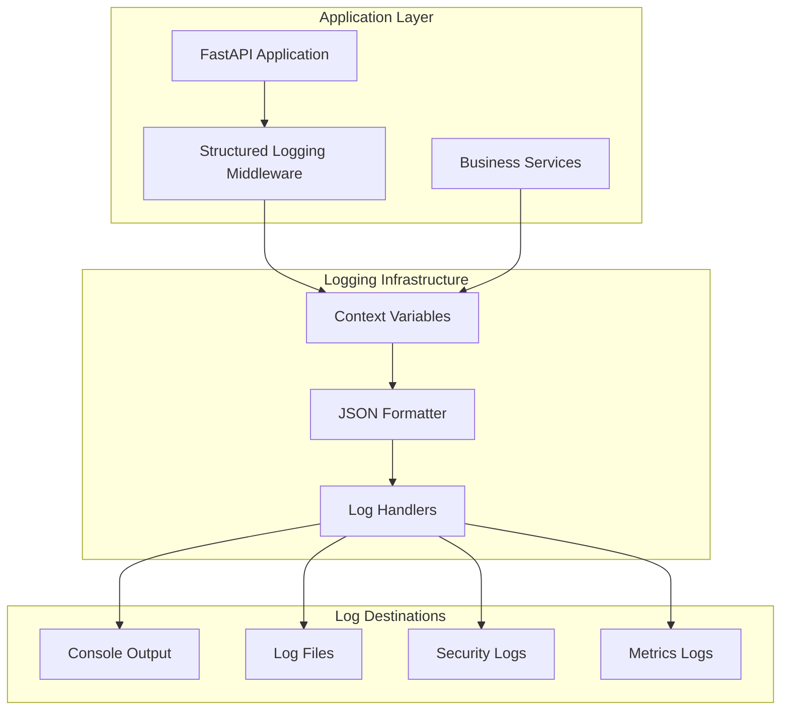

# Structured Logging Implementation Guide

**Version**: 1.0  
**Datum**: 2025-01-27  
**Autor**: Chief Architect & Lead Auditor  

---

## Overview

Das ImmoNow-System implementiert **strukturiertes Logging** mit Request-ID und Tenant-ID für umfassende Audit-Trails, Performance-Monitoring und Compliance-Anforderungen.

### Kern-Features

- **Request-Tracking**: Jede Anfrage erhält eine eindeutige Request-ID
- **Tenant-Isolation**: Alle Logs sind mit Tenant-ID kontextualisiert
- **Structured JSON**: Logs im JSON-Format für einfache Verarbeitung
- **Audit-Trails**: Vollständige Nachverfolgung aller kritischen Aktionen
- **Performance-Metriken**: Automatische Latenz-Messung
- **Error-Tracking**: Strukturierte Fehlerprotokollierung

---

## 1. Architecture Overview

### 1.1 Logging Layers



### 1.2 Context Variables

Das System nutzt Python Context Variables für Thread-sichere Request-Tracking:

```python
# Context variables
request_id_var: ContextVar[Optional[str]] = ContextVar('request_id', default=None)
tenant_id_var: ContextVar[Optional[str]] = ContextVar('tenant_id', default=None)
user_id_var: ContextVar[Optional[str]] = ContextVar('user_id', default=None)
```

---

## 2. Middleware Implementation

### 2.1 StructuredLoggingMiddleware

Das Middleware ist das Herzstück des Logging-Systems:

```python
class StructuredLoggingMiddleware(BaseHTTPMiddleware):
    async def dispatch(self, request: Request, call_next):
        # Generate request ID
        request_id = str(uuid.uuid4())
        request_id_var.set(request_id)
        
        # Extract tenant and user info
        tenant_id = self._extract_tenant_id(request)
        user_id = self._extract_user_id(request)
        
        # Log request start
        self.logger.info("Request started", extra={
            "request_id": request_id,
            "tenant_id": tenant_id,
            "user_id": user_id,
            "method": request.method,
            "url": str(request.url),
            "event_type": "request_start"
        })
        
        # Process request
        response = await call_next(request)
        
        # Log request completion
        self.logger.info("Request completed", extra={
            "request_id": request_id,
            "status_code": response.status_code,
            "duration_ms": duration_ms,
            "event_type": "request_complete"
        })
        
        return response
```

### 2.2 Integration in FastAPI

```python
# main.py
from app.middleware.structured_logging import (
    StructuredLoggingMiddleware,
    setup_structured_logging
)

def create_app() -> FastAPI:
    # Setup structured logging
    setup_structured_logging()
    
    # Add middleware (must be first)
    app.add_middleware(StructuredLoggingMiddleware)
    
    return app
```

---

## 3. Log Format

### 3.1 JSON Log Structure

Alle Logs folgen einem einheitlichen JSON-Schema:

```json
{
  "timestamp": "2025-01-27T10:00:00.000Z",
  "level": "INFO",
  "logger": "immonow.request",
  "message": "Request completed",
  "request_id": "550e8400-e29b-41d4-a716-446655440000",
  "tenant_id": "tenant-123",
  "user_id": "user-456",
  "method": "POST",
  "url": "https://api.immonow.com/api/v1/properties",
  "status_code": 201,
  "duration_ms": 245.67,
  "event_type": "request_complete",
  "client_ip": "192.168.1.100",
  "user_agent": "Mozilla/5.0..."
}
```

### 3.2 Event Types

| Event Type | Description | Use Case |
|------------|-------------|----------|
| `request_start` | Request initiated | Performance monitoring |
| `request_complete` | Request completed successfully | Performance monitoring |
| `request_error` | Request failed | Error tracking |
| `audit` | Security/compliance events | Audit trails |
| `business` | Business events | Analytics |
| `metric` | Performance metrics | Monitoring |
| `error` | Application errors | Debugging |

---

## 4. Audit Logging

### 4.1 Audit Event Structure

```python
def log_audit_event(
    event_type: str,
    resource_type: str,
    resource_id: str,
    action: str,
    details: Optional[Dict[str, Any]] = None,
    user_id: Optional[str] = None,
    tenant_id: Optional[str] = None
):
    """Log audit events for compliance and security"""
    
    audit_data = {
        "event_type": event_type,
        "resource_type": resource_type,
        "resource_id": resource_id,
        "action": action,
        "timestamp": datetime.utcnow().isoformat() + "Z",
        "event_category": "audit"
    }
    
    if details:
        audit_data["details"] = details
    
    logger.info("Audit event", extra=audit_data)
```

### 4.2 Critical Audit Events

#### User Management
```python
# User registration
log_audit_event(
    event_type="user_registration_success",
    resource_type="user",
    resource_id=str(user.id),
    action="create",
    details={
        "email": user.email,
        "tenant_id": str(tenant.id),
        "role": tenant_user.role
    },
    user_id=str(user.id),
    tenant_id=str(tenant.id)
)

# User login
log_audit_event(
    event_type="user_login_success",
    resource_type="user",
    resource_id=str(user.id),
    action="authenticate",
    details={
        "login_method": "password",
        "ip_address": request.client.host
    },
    user_id=str(user.id),
    tenant_id=str(tenant.id)
)
```

#### Data Access
```python
# Property access
log_audit_event(
    event_type="property_accessed",
    resource_type="property",
    resource_id=str(property.id),
    action="read",
    details={
        "property_title": property.title,
        "access_method": "api"
    },
    user_id=str(user.id),
    tenant_id=str(tenant.id)
)

# Document download
log_audit_event(
    event_type="document_downloaded",
    resource_type="document",
    resource_id=str(document.id),
    action="download",
    details={
        "document_name": document.name,
        "file_size": document.size
    },
    user_id=str(user.id),
    tenant_id=str(tenant.id)
)
```

#### Security Events
```python
# Failed login attempt
log_audit_event(
    event_type="login_failed",
    resource_type="user",
    resource_id=email,
    action="authenticate",
    details={
        "reason": "invalid_password",
        "ip_address": request.client.host,
        "user_agent": request.headers.get("user-agent")
    }
)

# Permission denied
log_audit_event(
    event_type="permission_denied",
    resource_type="property",
    resource_id=str(property.id),
    action="update",
    details={
        "required_permission": "write",
        "user_permissions": user.scopes
    },
    user_id=str(user.id),
    tenant_id=str(tenant.id)
)
```

---

## 5. Business Event Logging

### 5.1 Business Event Structure

```python
def log_business_event(
    event_type: str,
    event_data: Dict[str, Any],
    level: str = "INFO"
):
    """Log business events for analytics and monitoring"""
    
    business_data = {
        "event_type": event_type,
        "timestamp": datetime.utcnow().isoformat() + "Z",
        "event_category": "business",
        **event_data
    }
    
    logger.info("Business event", extra=business_data)
```

### 5.2 Key Business Events

#### Property Management
```python
# Property created
log_business_event(
    event_type="property_created",
    event_data={
        "property_id": str(property.id),
        "property_type": property.property_type,
        "price": float(property.price),
        "area": property.area,
        "rooms": property.rooms
    }
)

# Property sold
log_business_event(
    event_type="property_sold",
    event_data={
        "property_id": str(property.id),
        "sale_price": float(property.price),
        "days_on_market": days_on_market,
        "agent_id": str(property.created_by.id)
    }
)
```

#### Subscription Events
```python
# Plan upgrade
log_business_event(
    event_type="plan_upgraded",
    event_data={
        "tenant_id": str(tenant.id),
        "old_plan": old_plan,
        "new_plan": new_plan,
        "billing_cycle": billing_cycle
    }
)

# Limit exceeded
log_business_event(
    event_type="limit_exceeded",
    event_data={
        "tenant_id": str(tenant.id),
        "limit_type": "users",
        "current_count": current_count,
        "limit": limit
    }
)
```

---

## 6. Performance Monitoring

### 6.1 Performance Metrics

```python
def log_performance_metric(
    metric_name: str,
    value: float,
    unit: str = "ms",
    tags: Optional[Dict[str, str]] = None
):
    """Log performance metrics"""
    
    metric_data = {
        "metric_name": metric_name,
        "value": value,
        "unit": unit,
        "timestamp": datetime.utcnow().isoformat() + "Z",
        "event_category": "metric"
    }
    
    if tags:
        metric_data["tags"] = tags
    
    logger.info("Performance metric", extra=metric_data)
```

### 6.2 Key Performance Metrics

#### API Performance
```python
# Request duration
log_performance_metric(
    metric_name="api_request_duration",
    value=duration_ms,
    unit="ms",
    tags={
        "endpoint": "/api/v1/properties",
        "method": "POST",
        "status_code": "201"
    }
)

# Database query time
log_performance_metric(
    metric_name="db_query_duration",
    value=query_time_ms,
    unit="ms",
    tags={
        "table": "properties",
        "operation": "select",
        "tenant_id": tenant_id
    }
)
```

#### Business Metrics
```python
# Storage usage
log_performance_metric(
    metric_name="storage_usage_bytes",
    value=storage_bytes,
    unit="bytes",
    tags={
        "tenant_id": tenant_id,
        "storage_type": "documents"
    }
)

# Active users
log_performance_metric(
    metric_name="active_users_count",
    value=active_users,
    unit="count",
    tags={
        "tenant_id": tenant_id
    }
)
```

---

## 7. Error Logging

### 7.1 Error Logging Structure

```python
def log_error(
    error: Exception,
    context: Optional[Dict[str, Any]] = None,
    level: str = "ERROR"
):
    """Log errors with context"""
    
    error_data = {
        "error_type": type(error).__name__,
        "error_message": str(error),
        "timestamp": datetime.utcnow().isoformat() + "Z",
        "event_category": "error"
    }
    
    if context:
        error_data["context"] = context
    
    getattr(logger, level.lower())("Error occurred", extra=error_data, exc_info=True)
```

### 7.2 Error Categories

#### Authentication Errors
```python
try:
    user = await authenticate_user(email, password)
except UnauthorizedError as e:
    log_error(
        error=e,
        context={
            "email": email,
            "ip_address": request.client.host,
            "user_agent": request.headers.get("user-agent")
        }
    )
    raise
```

#### Business Logic Errors
```python
try:
    await BillingGuard.check_limit(tenant_id, 'users', 1)
except ValidationError as e:
    log_error(
        error=e,
        context={
            "tenant_id": tenant_id,
            "limit_type": "users",
            "current_count": current_count,
            "limit": limit
        }
    )
    raise
```

#### System Errors
```python
try:
    await storage_service.upload_file(file)
except Exception as e:
    log_error(
        error=e,
        context={
            "file_name": file.filename,
            "file_size": file.size,
            "tenant_id": tenant_id
        }
    )
    raise
```

---

## 8. Log Configuration

### 8.1 Log Levels

| Logger | Level | Purpose |
|--------|-------|---------|
| `immonow` | INFO | General application logs |
| `immonow.request` | INFO | HTTP request logs |
| `immonow.security` | INFO | Security and audit logs |
| `immonow.business` | INFO | Business event logs |
| `immonow.metrics` | INFO | Performance metrics |
| `immonow.error` | ERROR | Error logs |

### 8.2 Log Destinations

#### Console Output
- **Format**: Structured JSON
- **Level**: INFO
- **Use Case**: Development and debugging

#### File Output
- **Location**: `/var/log/immonow/`
- **Rotation**: 10MB per file, 5 backups
- **Files**:
  - `app.log` - General application logs
  - `requests.log` - HTTP request logs
  - `security.log` - Security and audit logs
  - `errors.log` - Error logs

### 8.3 Log Rotation

```python
# File handler configuration
file_handler = logging.handlers.RotatingFileHandler(
    "/var/log/immonow/app.log",
    maxBytes=10 * 1024 * 1024,  # 10MB
    backupCount=5
)
```

---

## 9. Monitoring & Alerting

### 9.1 Log Analysis

#### Request Patterns
```bash
# Analyze request patterns
grep "request_complete" /var/log/immonow/requests.log | \
jq -r '.duration_ms' | \
awk '{sum+=$1; count++} END {print "Average:", sum/count "ms"}'
```

#### Error Rates
```bash
# Calculate error rates by endpoint
grep "request_error" /var/log/immonow/requests.log | \
jq -r '.url' | \
sort | uniq -c | sort -nr
```

#### Tenant Activity
```bash
# Analyze tenant activity
grep "tenant_id" /var/log/immonow/app.log | \
jq -r '.tenant_id' | \
sort | uniq -c | sort -nr
```

### 9.2 Alerting Rules

#### High Error Rate
```yaml
# Prometheus alerting rule
- alert: HighErrorRate
  expr: rate(log_entries{level="ERROR"}[5m]) > 0.1
  for: 2m
  labels:
    severity: warning
  annotations:
    summary: "High error rate detected"
    description: "Error rate is {{ $value }} errors per second"
```

#### Slow Requests
```yaml
- alert: SlowRequests
  expr: histogram_quantile(0.95, rate(request_duration_ms_bucket[5m])) > 1000
  for: 5m
  labels:
    severity: warning
  annotations:
    summary: "Slow requests detected"
    description: "95th percentile latency is {{ $value }}ms"
```

---

## 10. Compliance & Security

### 10.1 DSGVO Compliance

#### Data Minimization
- Logs enthalten nur notwendige Daten
- PII wird anonymisiert oder verschlüsselt
- Logs werden nach Retention-Policy gelöscht

#### Right to be Forgotten
```python
# Log anonymization for deleted users
def anonymize_user_logs(user_id: str):
    """Anonymize logs for deleted user"""
    # Replace user_id with anonymized version
    anonymized_id = f"deleted_user_{hash(user_id)}"
    
    # Update log files (simplified example)
    subprocess.run([
        "sed", "-i", 
        f"s/{user_id}/{anonymized_id}/g",
        "/var/log/immonow/*.log"
    ])
```

### 10.2 Security Considerations

#### Log Integrity
- Logs werden mit HMAC-Signaturen versehen
- Schreibzugriff auf Log-Dateien ist eingeschränkt
- Logs werden regelmäßig auf Manipulation geprüft

#### Access Control
```bash
# Set proper permissions
chmod 640 /var/log/immonow/*.log
chown root:immonow /var/log/immonow/*.log
```

---

## 11. Best Practices

### 11.1 Logging Guidelines

#### Do's
- ✅ Verwende strukturierte Logs (JSON)
- ✅ Füge Request-ID zu allen Logs hinzu
- ✅ Logge alle kritischen Geschäftsvorgänge
- ✅ Verwende aussagekräftige Event-Types
- ✅ Füge Kontext-Informationen hinzu

#### Don'ts
- ❌ Logge keine Passwörter oder Tokens
- ❌ Logge keine großen Datenmengen
- ❌ Verwende keine unstrukturierten Logs
- ❌ Logge nicht zu häufig (Performance)
- ❌ Logge keine PII ohne Anonymisierung

### 11.2 Performance Considerations

#### Async Logging
```python
# Use async logging for high-throughput scenarios
import asyncio
import aiofiles

async def async_log_writer(log_data: dict):
    """Async log writer for high-performance scenarios"""
    async with aiofiles.open("/var/log/immonow/app.log", "a") as f:
        await f.write(json.dumps(log_data) + "\n")
```

#### Log Sampling
```python
# Sample logs for high-volume endpoints
def should_log_request(endpoint: str) -> bool:
    """Determine if request should be logged"""
    high_volume_endpoints = ["/api/v1/analytics", "/api/v1/health"]
    
    if endpoint in high_volume_endpoints:
        return random.random() < 0.1  # Log 10% of requests
    return True
```

---

## 12. Troubleshooting

### 12.1 Common Issues

#### Missing Request ID
```python
# Check if middleware is properly configured
def check_middleware_order(app: FastAPI):
    """Verify middleware order"""
    middleware_stack = app.user_middleware
    structured_logging_found = False
    
    for middleware in middleware_stack:
        if "StructuredLoggingMiddleware" in str(middleware):
            structured_logging_found = True
            break
    
    if not structured_logging_found:
        raise RuntimeError("StructuredLoggingMiddleware not found")
```

#### Context Variable Issues
```python
# Debug context variables
def debug_context():
    """Debug context variables"""
    print(f"Request ID: {request_id_var.get()}")
    print(f"Tenant ID: {tenant_id_var.get()}")
    print(f"User ID: {user_id_var.get()}")
```

### 12.2 Performance Issues

#### High Log Volume
```bash
# Monitor log file sizes
du -sh /var/log/immonow/*.log

# Check log rotation
ls -la /var/log/immonow/*.log*
```

#### Slow Logging
```python
# Profile logging performance
import time
import cProfile

def profile_logging():
    """Profile logging performance"""
    start_time = time.time()
    
    for i in range(1000):
        log_business_event(
            event_type="test_event",
            event_data={"iteration": i}
        )
    
    end_time = time.time()
    print(f"Logged 1000 events in {end_time - start_time:.2f} seconds")
```

---

## Conclusion

Das strukturierte Logging-System von ImmoNow bietet:

- **Vollständige Audit-Trails** für Compliance-Anforderungen
- **Performance-Monitoring** für Optimierung
- **Error-Tracking** für Debugging
- **Business-Analytics** für Insights
- **Security-Monitoring** für Bedrohungsabwehr

Das System ist darauf ausgelegt, skalierbar, sicher und DSGVO-konform zu sein, während es gleichzeitig wertvolle Einblicke in die Anwendungsleistung und das Benutzerverhalten bietet.
